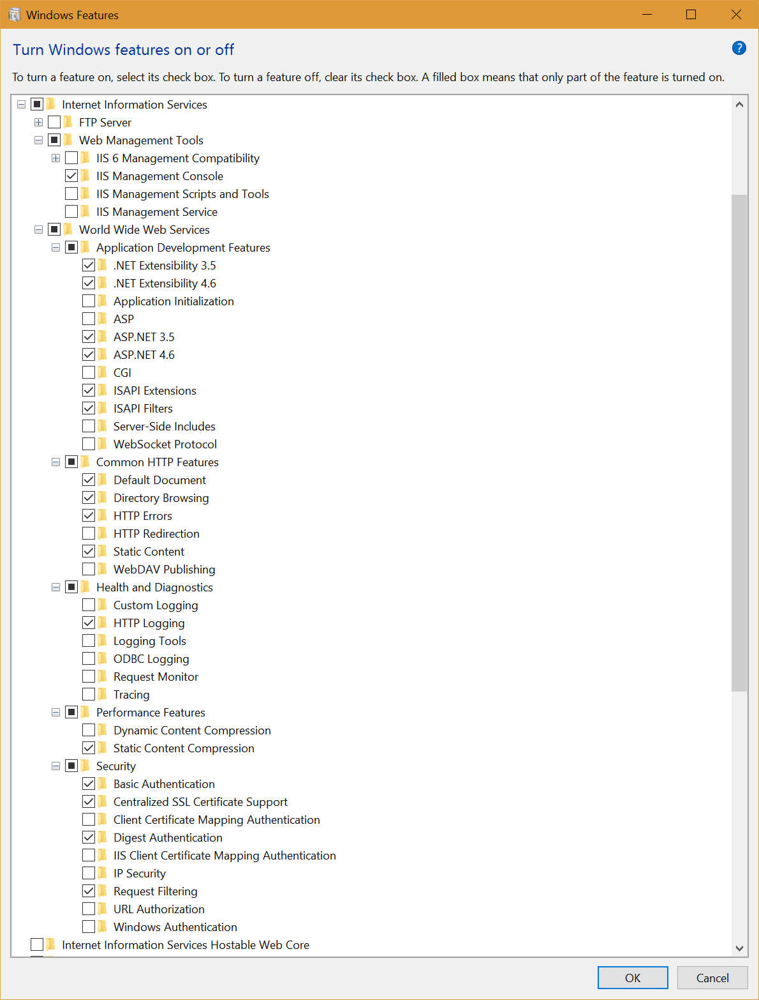

## Step 1 (Prerequisites)

Make sure that you have these software installed.

- Latest version of Visual Studio with Updates
- IIS
- SQL Server
- [PostgreSQL](https://www.postgresql.org/)
- [Git for Windows](https://git-scm.com/download/win)
- [Redis](https://github.com/MSOpenTech/redis/releases/download/win-3.2.100/Redis-x64-3.2.100.msi)

**IIS Configuration**



After installing Git for Windows, clone this repository.

```
  cd path/to/a/directory
  git clone https://github.com/mixerp/init
```

Once you clone the repository, explore to the folder where you cloned it.

Edit the files under the folder **"env"**. Make sure that you do not end up with a new line.


## **Step 2 (Edit hosts file)**

Edit the ***hosts*** file on ***C:\Windows\System32\drivers\etc*** and include the following domains to point back to loopback IP address.

- postgresql.localhost
- sqlserver. Localhost

**Example**

```
# Copyright (c) 1993-2009 Microsoft Corp.
#
# This is a sample HOSTS file used by Microsoft TCP/IP for Windows.
#
# This file contains the mappings of IP addresses to host names. Each
# entry should be kept on an individual line. The IP address should
# be placed in the first column followed by the corresponding host name.
# The IP address and the host name should be separated by at least one
# space.
#
# Additionally, comments (such as these) may be inserted on individual
# lines or following the machine name denoted by a '#' symbol.
#
# For example:
#
#      102.54.94.97     rhino.acme.com          # source server
#       38.25.63.10     x.acme.com              # x client host

# localhost name resolution is handled within DNS itself.
#	127.0.0.1       localhost
#	::1             localhost
127.0.0.1		    postgresql.localhost
127.0.0.1		    sqlserver.localhost
```


## Step 3 (Edit Configuration Files)

Explore the folder **/Overrides/src/Frapid.Web/Resources/Configs**. Edit these configuration files according to your environment:

- PostgreSQL.config
- SQLServer.config


Note, do not change the credentials of ***frapid_db_user*** and ***report_user*** unless you've changed them in the database.


### Step 4 (Associate .ps1 extension toWindows PowerShell)

Right click the file **mixerp-v2.ps1**, and click open with. Browse to the path:

**C:\Windows\System32\WindowsPowerShell\v1.0**

And select “powershell.exe”


**Additionally,** run **Windows PowerShell** as administrator. Enter the following command.

set-executionpolicyremotesigned


## Step 5 (Execute the File "run.bat")

Execute the file "run.bat".


## Step 6 (Access the Development Sites)

The following tenants were created on your machine.

- http://postgresql.localhost
- http://sqlserver.localhost


**Credentials**

demo@mixerp.org/1234@abcd


## How to Start over?

If you encounter errors or want to start over, perform these steps (at your own risk):

* Delete the folder mentioned in the file ***env\SolutionDirectory.txt***
* Delete the IIS Site ***FrapidDevelopment***
* Delete the IIS App Pool ***FrapidDevelopment***


